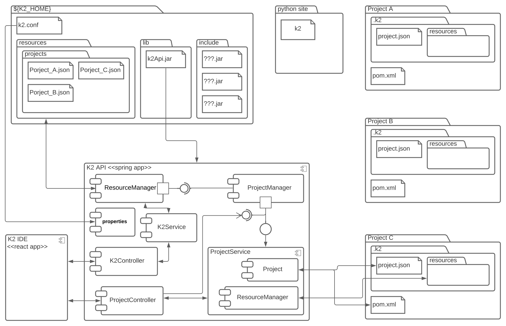

# K2 Integrated Application Development 

K2 is a data driven IDE.  It runs as a web service running locally to manage projects in local directories.

The diagram below show the major components of a K2 implementation.

## Functional Areas

- [K2 API](functional_areas/k2_api)
- [K2 IDE](functional_areas/k2_ide/K2_IDE.md)
- [K2 CLI](functional_areas/k2_cli/K2_CLI.md)

